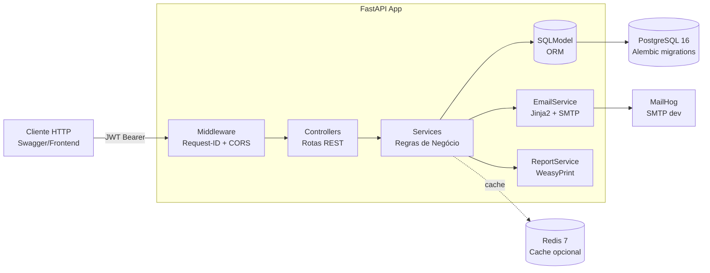
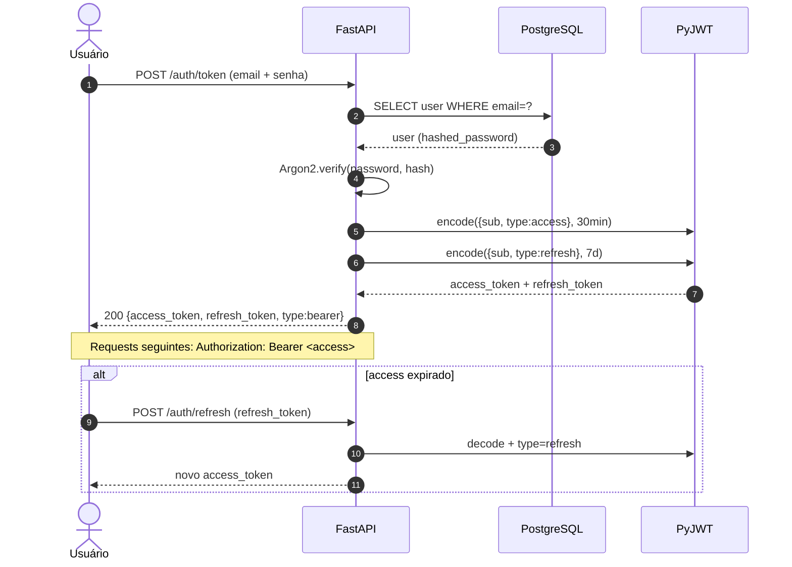

# FinanSee API

[](https://github.com/Lidianacosta/BackendFinanSee/actions/workflows/ci.yml)
[](https://codecov.io/gh/Lidianacosta/BackendFinanSee)
[](https://www.python.org)
[](https://fastapi.tiangolo.com)
[](LICENSE)
[](https://github.com/Lidianacosta/BackendFinanSee/blob/main/Dockerfile)
[](https://sonarcloud.io/dashboard?id=Lidianacosta_BackendFinanSee)

> Backend de controle financeiro pessoal, focado no mercado brasileiro:
> cadastro com validação de CPF/telefone/idade, categorias, despesas,
> períodos mensais, análises financeiras e exportação de relatórios em PDF.

## Índice

- [Stack](#stack)
- [Arquitetura](#arquitetura)
- [Quick Start (Docker)](#quick-start-docker)
- [Endpoints](#endpoints)
- [Modelos de dados](#modelos-de-dados)
- [Autenticação](#autenticação)
- [Desenvolvimento](#desenvolvimento)
- [Observabilidade](#observabilidade)

## Arquitetura

### Visão geral (C4 — Nível 2: Contêineres)



### Fluxo de autenticação (sequência)



## Stack

- **FastAPI** 0.136 (async) + **SQLModel**/**SQLAlchemy** + **asyncpg** (Postgres) / **aiosqlite** (fallback de testes)
- **pwdlib (Argon2)** para hashing de senha, **PyJWT** para access/refresh tokens
- **fastapi-mail** + **Jinja2** para emails transacionais
- **WeasyPrint** para relatórios em PDF
- **Alembic** para migrations de schema (async)
- **Pydantic v2** (`pydantic-settings`) para configuração via `.env`
- **Redis 7** disponível via `docker-compose` para cache futuro
- **MailHog** para captura de emails em desenvolvimento

## Requisitos

- **Opção A (recomendada):** Docker + Docker Compose
- **Opção B:** Python 3.12+ e [uv](https://docs.astral.sh/uv/)
- WeasyPrint depende de libs do sistema no Ubuntu:
  `libpango libcairo libgdk-pixbuf2.0-0`

## Quick Start (Docker) 🐳

Sobe **API + Postgres 16 + Redis 7 + MailHog + pgAdmin** com um comando:

```bash
# 1. Copiar e preencher variáveis
cp .env.example .env
# Edite .env com POSTGRES_PASSWORD e PGADMIN_DEFAULT_PASSWORD

# 2. Subir a stack completa
docker compose up -d

# 3. Aplicar migrations
docker compose exec app alembic upgrade head

# 4. (Opcional) Seed inicial
docker compose exec app python -m scripts.seed  # se existir
```

| Serviço | URL | Credenciais |
|---|---|---|
| API (Swagger) | http://localhost:8000/docs | - |
| pgAdmin | http://localhost:8081 | Veja `.env` |
| MailHog | http://localhost:8025 | sem auth |
| Postgres | `localhost:5432` | Veja `.env` |
| Redis | `localhost:6379` | sem auth |

### Setup local (sem Docker)

```bash
# Instalar dependências
uv sync

# Aplicar migrations ao SQLite local
uv run alembic upgrade head

# Rodar em desenvolvimento
uv run fastapi dev src/main.py
# ou: uv run uvicorn src.main:app --reload
```

## Variáveis de ambiente

Veja `.env.example`. As obrigatórias em produção são `SECRET_KEY` e
`MAIL_PASSWORD`; a inicialização falha sem elas quando `ENVIRONMENT=production`.

## Endpoints

Todos os endpoints estão sob `/api`. As rotas protegidas exigem um
**access token JWT** no header `Authorization: Bearer <token>`.

### Auth

| Método | Rota | Auth | Descrição |
|---|---|---|---|
| POST | `/auth/token` | - | Login (OAuth2 password flow), retorna access + refresh |
| POST | `/auth/refresh` | - | Renova access token via refresh token |
| POST | `/auth/forgot-password` | - | Envia email de recuperação de senha |
| POST | `/auth/reset-password` | - | Redefine senha usando token de reset |

### Users

| Método | Rota | Auth | Descrição |
|---|---|---|---|
| POST | `/users/` | - | Cadastro de usuário (envia email de boas-vindas) |
| GET | `/users/me/` | Sim | Perfil do usuário autenticado |
| PATCH | `/users/me/` | Sim | Atualiza perfil (renda sincroniza com período atual) |
| DELETE | `/users/me/` | Sim | Exclui a própria conta |

### Categories

| Método | Rota | Auth | Descrição |
|---|---|---|---|
| POST | `/categories/` | Sim | Cria categoria (nome único por usuário) |
| GET | `/categories/` | Sim | Lista categorias do usuário |
| GET | `/categories/{id}` | Sim | Detalhe de uma categoria |
| PATCH | `/categories/{id}` | Sim | Atualiza categoria |
| DELETE | `/categories/{id}` | Sim | Exclui (bloqueado se houver despesas) |

### Expenses

| Método | Rota | Auth | Descrição |
|---|---|---|---|
| POST | `/expenses/` | Sim | Cria despesa (auto-resolve período por `due_date`) |
| GET | `/expenses/` | Sim | Lista com filtros: `period_id`, `search`, `category_ids`, `status`, `offset`, `limit` |
| GET | `/expenses/{id}` | Sim | Detalhe de uma despesa |
| PATCH | `/expenses/{id}` | Sim | Atualiza despesa (impede pagar despesa já paga) |
| DELETE | `/expenses/{id}` | Sim | Exclui despesa |

### Periods

| Método | Rota | Auth | Descrição |
|---|---|---|---|
| POST | `/periods/` | Sim | Cria período mensal |
| GET | `/periods/` | Sim | Lista períodos (desc por mês) |
| GET | `/periods/current/` | Sim | Recupera ou cria período do mês atual |
| GET | `/periods/{id}` | Sim | Detalhe de um período |
| GET | `/periods/{id}/summary` | Sim | Resumo: receita, total pago, pendente, saldo restante |
| GET | `/periods/{id}/evolution` | Sim | Evolução financeira 3 meses antes/depois |
| GET | `/periods/{id}/analysis` | Sim | Análise diária + categoria que mais aparece |
| GET | `/periods/{id}/export` | Sim | Exporta relatório do período em PDF |

### Root

| Método | Rota | Auth | Descrição |
|---|---|---|---|
| GET | `/` | - | Verifica se a API está no ar |

## Desenvolvimento

```bash
# Lint + format check
uv run ruff check src/ tests/ migrations/
uv run ruff format --check src/ tests/

# Type check
uv run mypy src/

# Testes (com cobertura e SQLite :memory:)
uv run pytest

# Criar nova migration após alterar models
rm -f db.sqlite
uv run alembic revision --autogenerate -m "descreva a mudança"
uv run alembic upgrade head

# Reverter a última migration
uv run alembic downgrade -1
```

## Modelos de dados

5 entidades + 1 tabela de ligação (todas com `ondelete=CASCADE`):

- **User** — name, email (unique), hashed_password, cpf (unique),
  date_of_birth, phone_number (unique), income, is_staff, is_active
- **Category** — name, description, user_id;
  `UniqueConstraint(user_id, name)`
- **Expense** — name, value, due_date, payment_date, description, is_fixed,
  payment_method, status (`PENDING`/`PAID`), period_id, user_id
- **Period** — month (normalizado para dia 1),
  total_income; `UniqueConstraint(user_id, month)`
- **ExpenseCategoryLink** — relação N:N entre Expense e Category

## Autenticação

Fluxo OAuth2 Password Flow com JWT:

1. `POST /auth/token` com `username` (email) + `password` (form) →
   retorna `access_token` (curto, padrão 30min) + `refresh_token` (longo, 7 dias),
   ambos com claim `type` (`access`/`refresh`) para evitar reuso cruzado.
2. Quando o access expirar, `POST /auth/refresh` com `refresh_token` no body →
   retorna novo `access_token` (mesmo `refresh_token` é ecoado).
3. Recuperação de senha via `POST /auth/forgot-password` (token JWT 15min
   com claim `type=password_reset`).

Senhas são hasheadas com **Argon2** via `pwdlib`.

## Arquitetura

```
src/
├── main.py            # Entry point, lifespan, middlewares (CORS, logging)
├── core/
│   ├── config.py      # Settings via Pydantic BaseSettings
│   └── logging.py     # Structured logging + request middleware
├── controllers/       # Routers HTTP (camada fina)
├── services/          # Regra de negócio + acesso a DB
├── models/            # Entidades SQLModel (table=True)
├── schemas/           # DTOs Pydantic (Base/Create/Update/Read)
├── utils/             # database, password, security (JWT), validators
└── templates/         # Jinja2: report.html + emails (welcome, password_reset)
migrations/            # Alembic versions + env.py (async)
tests/
├── unit/              # Models, services e utils isolados
└── integration/controllers/  # Cliente HTTP + mock de EmailService
```

## Observabilidade

- Logs estruturados em stdout com `request_id` por request
  (middleware `RequestLoggingMiddleware`) — method, path, status e
  duração em ms; exceções não tratadas emitidas com traceback
- Header `X-Request-ID` retornado em toda resposta (echo ou gerado)
- Docs interativas: `/docs` (Swagger) e `/redoc`
